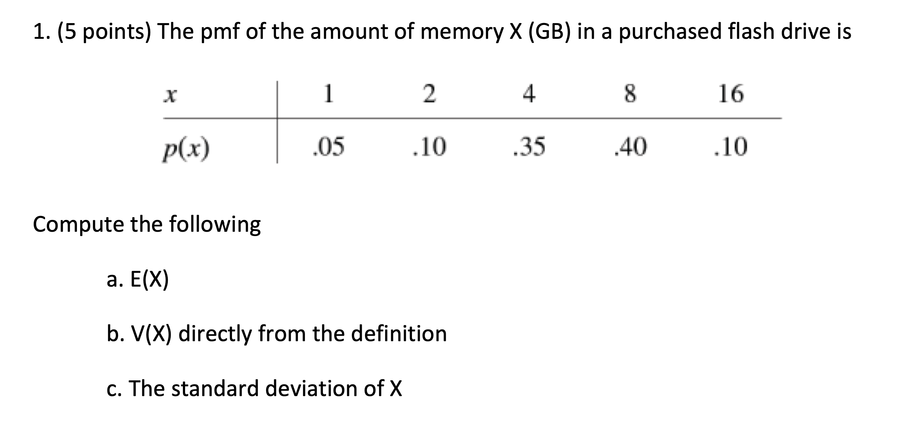
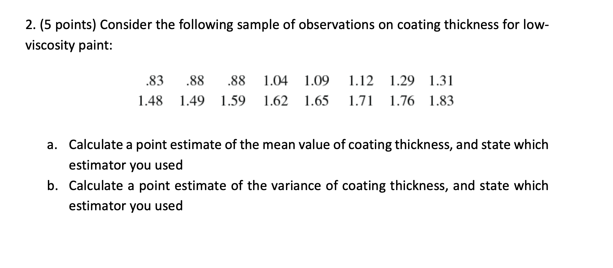
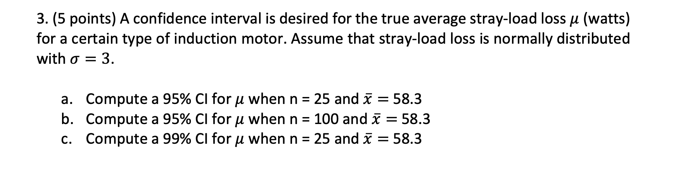
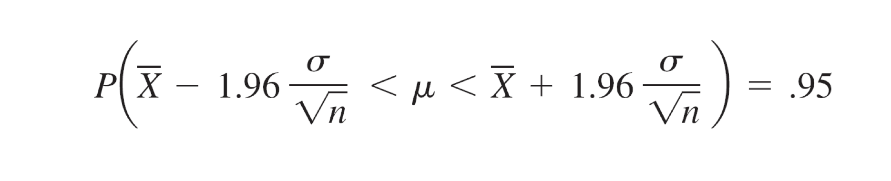
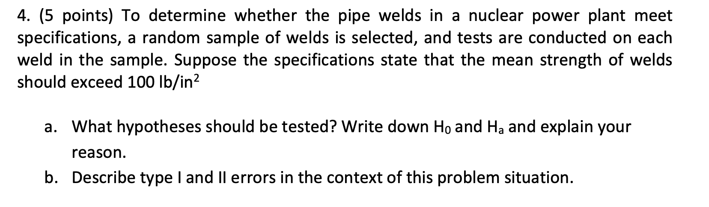
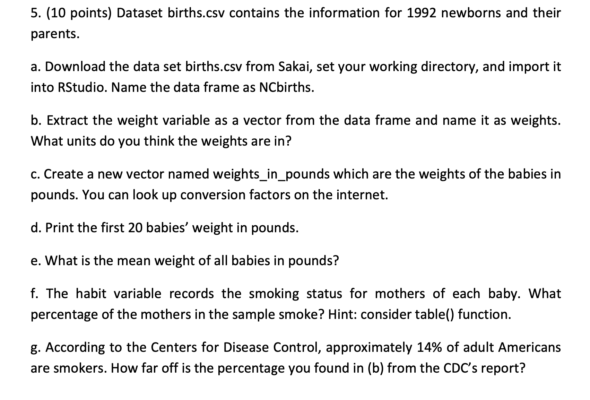
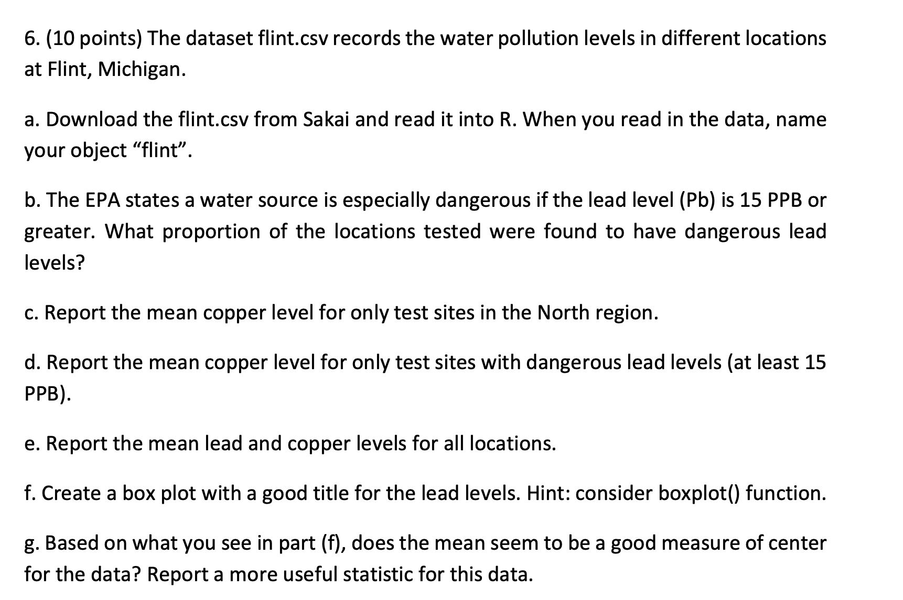
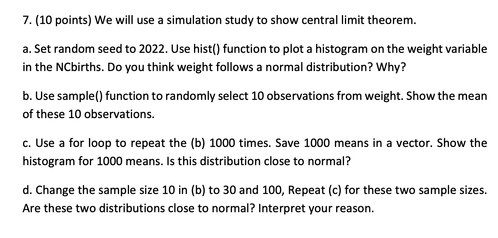

```{r setup, include=FALSE}
knitr::opts_chunk$set(echo = TRUE)
library(tidyverse)
```

# Q1:

```{r Q1, echo=FALSE, fig.cap="A caption", out.width = '100%'}


```

## a)

```{r Q1:A)}
#E(x) = sum of (xi * p(xi)) for every xi (for discrete pmf)
#E(x) = 1 * 0.05 + 2 * 0.10 + 4 * 0.35 + 8 * 0.4 + 16 * .01
E_x <- 1 * 0.05 + 2 * 0.10 + 4 * 0.35 + 8 * 0.4 + 16 * .01
print(E_x)

```

E(X) = 5.01

## b)

```{r Q1:b}
#V(x) = E(X-mu)^2 = E(X^2) - (E(x))^2
#V(x) = 1 * 0.05 + 4 * 0.10 + 16 * 0.35 + 64 * 0.4 + 256 * .01 - (5.01^2)
V_x <- 1 * 0.05 + 4 * 0.10 + 16 * 0.35 + 64 * 0.4 + 256 * .01 - (5.01^2)
print(V_x)
```

V(X) = 9.1099

## c)

```{r}
#SD = sqrt(variance)
sd <- sqrt(V_x)
sd

```

SD = 3.018

# Q2:

```{r Q2, echo=FALSE, fig.cap="A caption", out.width = '100%'}

```

## a)

```{r Q2:A)}
#Point estimate for mean value of coating thickness using sample
sample <- c(0.83,0.88,0.88,1.04,1.09,1.12,1.29,1.31,1.48,1.49,1.59,1.62,1.65,1.71,1.76,1.83)
X_bar <- mean(sample)
X_bar


```

point estimate used is X_bar, which is unbiased. X_bar is 1.348125

## b)

```{r Q2:b}
S <- var(sample)
S
```

point estimate used is S, which is unbiased point estimator for population variance. S is 0.1146029

# Q3:

```{r Q3, echo=FALSE, out.width = '100%'}

```

Formula for finding a 95% CI interval with normal distribution given by below image

```{r , echo=FALSE, out.width = '100%'}

```

## a)

```{r Q3:a}
x_bar_q3 <- 58.3
sd_q3 <- 3
n1 <- 25
z_score95 <- round(qnorm(0.025,lower.tail=FALSE),2)
CI_1 <- c((x_bar_q3 - (z_score95*sd_q3/sqrt(n1))), (x_bar_q3 + (z_score95*sd_q3)/sqrt(n1)))
CI_1
#Can also use function 
```

95% CI for mu when n=25 and X_bar = 58.3 is (57.124, 59.476)

## b)

```{r Q3:b}
n2 <- 100

CI_2 <- c((x_bar_q3 - (z_score95*sd_q3/sqrt(n2))), (x_bar_q3 + (z_score95*sd_q3)/sqrt(n2)))
CI_2
```

95% CI for mu when n=100 and X_bar = 58.3 is (57.712, 58.888)

## c)

```{r Q3:c}
#99% CI is the same as in image above, but instead of 1.96 the z-score value is 2.58
z_score99 <- round(qnorm(0.005,lower.tail=FALSE),2)
CI_3 <- c((x_bar_q3 - (z_score99*sd_q3/sqrt(n1))), (x_bar_q3 + (z_score99*sd_q3)/sqrt(n1)))
CI_3
```

99% CI for mu when n=25 and x_bar = 58.3 is (56.752, 59.848)

# Q4:

```{r Q4, echo=FALSE, out.width = '100%'}

```

## a)

$$ H_0: \mu = 100 \ lb/in^2 $$

$$ H_a: \mu > 100 \ lb/in^2 $$

Under this set of hypotheses, we are testing if the mean strength of welds exceed 100. I wrote it this way because under this, we assume that the null is true and that mean weld strength is equal to 100. The alternative in this scenario would be that mean strength exceeds 100, and we would look at the distribution of the test stat in order to determine the probability that mean strength is 100 or less. If lower than a designated significance level, $\alpha$, we would reject the null.

## b)

Type 1 error, represented by $\alpha$, is the probability that given the null is actually true, we end up falsely rejecting the null hypothesis. In the context of this problem, it is the probability of rejecting the null when the actual mean strength of welds is equal to 100 or lower.

Type 2 error, represented by $1 \ - \ \alpha$, or $\beta$, is the probability that given the null is actually false but we fail to reject it. In the context of this problem, it is the probability that we don't reject the null given that the strength of welds is actually exceeds 100.

# Q5:

```{r Q5, echo=FALSE, out.width = '100%'}

```

## a)

```{r Q5:a}
NCbirths <- read_csv("births.csv")

```

## b)

```{r Q5:b}
weights <-  NCbirths$weight
head(weights)
```

I think weights are most likely in measured in ounces, considering there are many 3 digit weight values.

## c)

```{r Q5:c}
#Conversion: 16 oz in 1 pound
oztolb <- 16
weights_in_pounds = weights/oztolb


```

## d)

```{r Q5:d}

head(weights_in_pounds, 20)
```

## e)

```{r Q5:e}

mean(weights_in_pounds)

```

Mean weight is 7.25 pounds

## f)

```{r Q5:f}
smoke_stat <- table(NCbirths$Habit)
smoke_percent <- smoke_stat[2]/sum(smoke_stat)
smoke_percent
```

About 9.4% of all mothers in the sample reported smoking during pregnancy

## g)

```{r Q5:g}
popsmoke <- 0.14
smoke_diff <- as.vector(popsmoke - smoke_percent)
smoke_diff
```

The difference b/w population smoke percentage and smoke percent in the sample was about 4.6%

# Q6:

```{r Q6, echo=FALSE, fig.cap="A caption", out.width = '100%'}

```

## a)

```{r Q6:a}

flint <- read_csv("flint.csv")
head(flint)
```

## b)

```{r Q6:b}
mean(flint$Pb>=15)

```

About 4.44% of the locations tested had dangerous lead levels of at least 15 PPB

## c)

```{r Q6:c}
clr <- flint %>% 
  group_by(Region) %>% 
  summarize("Average Copper Levels by Region" = mean(Cu))
clr
```

Average copper levels for Northern region is 44.642

## d)

```{r Q6:d}
clp <- flint %>% 
  group_by(Pb>=15) %>% 
  summarize("Average Copper Levels by Region" = mean(Cu))

clp
```

Average copper levels for areas with lead levels higher than 15 PPB is 305.833

## e)

```{r Q6:e}
flint %>% 
  summarize('Average Lead levels'= mean(Pb),"Average Copper Levels" = mean(Cu))
```

Across all locations, the average lead levels is 3.383 PPB and average copper levels is 54.581

## f)

```{r Q6:f}
boxplot(flint$Pb, Title = "Boxplot of lead levels")
```

## g)

Given the results of the boxplot, mean is not a very useful statistic for measuring the center of lead levels for the dataset This is because the average is pulled up by a few outlier values that are well above the center. A more useful stat for the measuring the center of lead levels would be median

```{r Q6:g}
median(flint$Pb)
```

Median value for this data set is 0, which makes sense since a vast majority of locations don't have any lead levels.

# Q7:

```{r Q7, echo=FALSE, fig.cap="A caption", out.width = '100%'}

```

## a)

```{r Q7:a}
set.seed(2022)
hist(NCbirths$weight)
```

Weight of newborns does not follow a normal distribution. Instead the distribution seems to be left skewed.

## b)

```{r Q7:b}
set.seed(2022)
mean(sample(NCbirths$weight,10))


```

Mean of this sample is 119 ounces.

## c)

```{r Q7:c}
set.seed(2022)
means <- c()
for(i in 1:1000){
  # sample_mean <- mean(sample(NCbirths$weight,10))
  means <- append(means,mean(sample(NCbirths$weight,10)))
}
hist(means)
```

The means of the weight is doesn't seem to follow a normal distribution, as the means of the weights seem to still be left skewed

## d)

```{r Q7:d}
set.seed(2022)
means_30 <- c()
for(i in 1:1000){
  # sample_mean <- mean(sample(NCbirths$weight,10))
  means_30 <- append(means_30,mean(sample(NCbirths$weight,30)))
}
hist(means_30)

means_100 <- c()
for(i in 1:1000){
  means_100 <- append(means_30,mean(sample(NCbirths$weight,100)))
}
hist(means_100)

```

After increasing the sample sizes to 30 and 100 respectively, the distribution of the weights becomes normal or approximately normal. This is because as stated by CLT, since the sample size of weights is now more than or equal to 30, the sample mean is normally distributed with mean mu and variance of sd\^2/n
